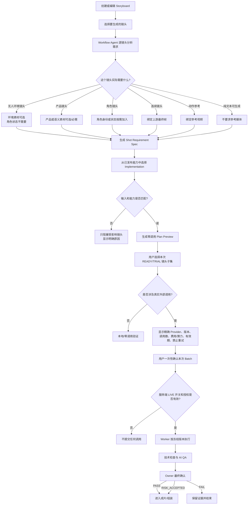
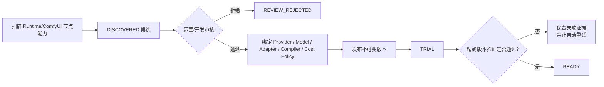

# Feature 016：简化门禁与能力驱动的 Workflow Agent

**状态**：规格与方案设计完成，尚未授权实施或任何真实生成调用
**日期**：2026-08-26
**英文规格**：[spec.md](./spec.md)
**实施方案**：[plan.md](./plan.md)

## 1. Feature 目标

Feature 016 要解决三个核心问题：

1. 去除 Project Assets、Semantic Assets、Character State、Storyboard Preparation 等项目级前置门禁，改为逐个镜头判断实际需要的素材。
2. Workflow Agent 不再绑定某个固定的 H3 五槽位 Workflow，而是根据镜头需求和已发布的生成能力选择实现。
3. 去除面向用户的 Fake Director、Fake 提案和 Fake 生成入口，同时保留测试 Fixture 与历史记录读取能力。

本 Feature 不取消真正涉及外部费用和最终成片所有权的边界：

- 真实付费调用仍需一次精确的执行时确认；
- 服务端 LIVE 开关默认关闭；
- 调用次数、费用上限、有效期必须明确；
- 禁止自动重试和静默切换 Provider；
- 最终结果仍需 Owner 明确作出 `PASS`、`FAIL` 或 `RISK_ACCEPTED`。

## 2. 改后的业务流程



### 流程变化总结

旧流程通常是：

```text
项目素材 READY
→ 语义素材 READY
→ 角色状态 READY
→ 分镜准备 READY
→ Storyboard/Shot Plan 审批
→ 才能进入生成
```

Feature 016 改为：

```text
选择镜头
→ Workflow Agent 分析该镜头需要什么
→ 选择满足需求的已发布能力
→ 生成零调用预览
→ 一次性确认本次真实付费 Batch
→ 执行
→ Owner 最终确认
```

其中 Shot Planner 仍会自动生成不可变的 `GenerationSpec V3`，作为创意规划与视频执行之间的
正式交接记录；它没有单独的 Owner 审批按钮，不会重新形成门禁，也不能被前端 Raw Prompt
或 Runtime Payload 绕过。

## 3. 前置素材是否必须填写

不再统一要求填写。是否需要由当前镜头和所选生成实现共同决定。

| 前置内容     | 新规则                                           | 示例                                                     |
| ------------ | ------------------------------------------------ | -------------------------------------------------------- |
| 项目素材     | 可选证据；只有镜头或实现确实依赖时才成为必需输入 | 产品包装、指定场景照片                                   |
| 语义素材库   | 可选；用于稳定身份、产品、环境、风格等语义       | “咖啡厅夜景 v3”                                          |
| 角色状态组合 | 仅角色存在且需要身份/外观/服装连续性时使用       | 无人空镜不需要角色状态                                   |
| 分镜准备     | 不再是独立门禁                                   | 由 Workflow Agent 生成逐镜头 Requirement 和 Plan Preview |
| 上游最终帧   | 仅连续镜头或首帧控制实现需要                     | Shot 02 使用 Shot 01 的最终帧                            |
| 参考视频     | 仅动作、运镜或场景运动需要                       | 行走动作参考                                             |
| 参考音频     | 仅实现明确支持且镜头需要时使用                   | 节奏或声音参考                                           |

缺少可选素材时，系统可以给出建议，但不能阻塞整个项目。只有当前镜头所选实现的真实硬性输入缺失时，该镜头才会被阻塞。

## 4. Runtime、Provider、Model、Adapter 和 Compiler 的区别

Feature 016 将此前混在一起的概念拆成六层：

| 层级                      | 回答的问题                                      | 例子                                                          |
| ------------------------- | ----------------------------------------------- | ------------------------------------------------------------- |
| Runtime                   | 在哪里、通过什么运行环境执行？                  | 本地 ComfyUI、远程 ComfyUI、直连 API Runtime                  |
| Provider                  | 谁提供推理、鉴权或计费能力？                    | Local Compute、ComfyUI Partner、第三方视频平台                |
| Model                     | 使用什么模型和版本？                            | Hailuo 03、Seedance、Wan                                      |
| Adapter                   | 应用如何提交、查询和取回结果？                  | `comfyui-mcp-v2`、某个 Direct API Adapter                     |
| Compiler Profile          | 如何把镜头语义编译成安全的节点、输入和 Prompt？ | H3 Reference Compiler、First/Last Frame Compiler              |
| Generation Implementation | 本次可以实际选择的完整版本组合                  | Runtime + Provider + Model + Adapter + Compiler + Cost Policy |

### ComfyUI 和 ComfyUI Partner 不是同一个概念

- ComfyUI 是 Runtime。
- ComfyUI Partner 是可能存在于 ComfyUI 内的一个 Provider/计费渠道。
- ComfyUI 也可以运行本地模型，Provider 此时是 `LOCAL_COMPUTE`。
- ComfyUI 还可以运行第三方自定义节点，其 Provider 可能是另一个远程平台。

因此不能通过“使用了 ComfyUI”推断“Provider 就是 ComfyUI Partner”。

### Adapter 是否需要为每个模型手工注册

不需要。

所有走相同 ComfyUI MCP 协议的本地模型、Partner 节点和第三方节点共享一个通用 `comfyui-mcp-v2` Adapter。Adapter 只负责：

- Runtime readiness；
- 提交任务；
- 查询状态；
- 取消任务；
- 对账与恢复状态；
- 获取输出 Artifact。

Adapter 不负责决定模型、节点、图片槽位、Prompt 语义和 Provider。模型与节点差异由 Compiler Profile 和 Generation Implementation 表达。

## 5. Provider 和能力如何进入系统

采用“自动发现候选 + 人工审核发布”，而不是完全手工或完全自动信任。



### 自动发现能确定的内容

- 节点标识；
- 输入和输出结构；
- 图片、视频、音频的动态数量范围；
- Runtime 来源和节点 Schema 摘要；
- 可发现的基础参数范围。

### 仍需审核确认的内容

- Provider 真实身份；
- 鉴权和计费责任；
- 模型及版本；
- 输入的业务语义和排序规则；
- 安全的 Compiler Profile；
- 输出映射；
- Cost Policy；
- 是否允许进入 TRIAL；
- READY 所需的技术证据。

因此，新增同协议的 ComfyUI 模型通常不需要再次开发 Adapter，但仍需要审核并发布其 Compiler Profile 和 Generation Implementation。

## 6. Hailuo 03 的初始能力规则

Feature 016 不再假设 H3 永远使用固定五个图片槽位，而是区分三类实现。

### 6.1 Text-to-Video

- 支持真正的零参考媒体生成；
- 只有 Prompt 也可以形成有效计划；
- 不应伪造一张参考图来满足旧 Workflow。

### 6.2 Reference-to-Video

- Reference Image：0–9；
- Reference Video：0–3；
- Reference Audio：0–3；
- 但必须满足：`图片数量 + 视频数量 >= 1`；
- Audio 不能作为唯一参考；
- 图片和视频按连接顺序形成 `Image 1`、`Image 2`、`Video 1` 等引用。

这些序号没有固定业务含义。例如 `Image 1` 不一定是角色脸部，可以是产品、环境或连续性帧。真实含义由冻结的输入快照和编译后的 Prompt 表达。

### 6.3 First/Last Frame

- First Frame 必需；
- Last Frame 可选；
- 适用于首帧控制、首尾帧控制和部分镜头连续性需求。

三个 H3 实现可以共享 `comfyui-mcp-v2`，但使用不同的 Compiler Profile 和 Input Contract。

## 7. 门禁调整

### 删除的业务门禁

- Project Assets READY；
- Semantic Assets READY；
- Character State READY；
- Storyboard Preparation READY；
- Storyboard Approval；
- Shot Plan Approval；
- Manifest、连续性方案或关键帧方案的重复 Owner 审批；
- 生成前重复确认同一创意范围。

### 保留的执行和所有权边界

- 当前镜头所需硬输入必须有效；
- Implementation、Runtime 和 Compiler 必须可用且版本一致；
- 外部 Provider 的价格信息必须有效；
- 服务端 LIVE 开关必须开启；
- 用户必须确认本次精确 Shot 集合、版本、调用数、费用上限和有效期；
- 禁止自动重试和自动 Provider fallback；
- 最终 Owner QA 必须明确完成。

这些属于资金、外部副作用和最终所有权控制，不属于已删除的创作流程门禁。

## 8. Fake 逻辑处理

从面向用户的产品路径中删除：

- “Generate three shots”；
- “New Fake proposal”；
- Fake Director 选项；
- Fake generation Provider 选项；
- 可以创建新 Fake 提案或生成记录的产品 API。

继续保留：

- 自动化测试使用的明确标记 Fixture；
- 历史 Fake Proposal、Plan、Batch 和 Artifact 的只读兼容；
- 既有证据和审计链路。

测试 Fixture 不得出现在生产 Registry 解析结果中，也不得被用户选择。

## 9. 核心数据对象

- `RuntimeProfile`：执行环境和协议边界。
- `ProviderProfile`：推理、鉴权和计费责任方。
- `ModelProfile`：模型家族和版本。
- `AdapterProfile`：通信协议实现。
- `CompilerProfile`：经过审核的模型/节点编译规则。
- `GenerationImplementation`：可实际选择的完整不可变组合。
- `DiscoveryCandidate`：自动发现但尚不可用的候选能力。
- `ShotRequirementSpecV3`：逐镜头、与 Provider 无关的需求说明。
- `PlanningInputSnapshot`：精确素材版本、顺序、用途和 Hash 快照。
- `GenerationPlanV3`：精确镜头集合、实现版本和编译结果。
- `GenerationAuthorizationV3`：一次真实执行的精确授权。
- `ImplementationEvidence`：某个精确实现版本的验证证据。

## 10. 关键验收标准

1. 所有无人镜头测试均不会产生角色或角色状态阻塞。
2. 相同输入重复规划时，需求、实现选择、输入顺序、原因和 Hash 完全一致。
3. Text-to-Video、Reference-to-Video 和上游最终帧场景都能选择兼容实现，或者返回稳定且可解释的单镜头阻塞原因。
4. 所有 `DISCOVERED` 候选在审核发布前均不可用于付费生成。
5. 为同一个 ComfyUI Runtime 增加兼容模型时，不需要分别在 Web 和 Worker 新增模型专用 Adapter。
6. 从保存 Storyboard 到一次付费 Batch 确认之间不存在强制中间审批。
7. 只提交本次选择且有效的镜头子集；受阻和未选择镜头产生零调用。
8. 产品 UI 和产品 API 不能创建新的 Fake 提案或生成记录。
9. 所有自动化验收产生零外部 AI/视频 Provider 调用。
10. 每个真实 Artifact 在进入成片前仍需明确的 Owner 最终决定。

## 11. 本 Feature 的实施边界

本阶段文档定义的是 Feature 016 的业务规格和实施方案，不代表已经：

- 修改现有业务代码；
- 发布新的 Provider 或 Compiler Profile；
- 启用任何 ComfyUI/视频 LIVE 执行；
- 授权任何付费调用；
- 删除历史数据。

后续实施应按照以下顺序进行：

```text
Registry V2 与共享 Adapter Factory
→ Discovery / Publication 生命周期
→ ShotRequirementSpecV3 与动态 Compiler
→ 新 Plan/Authorization/Worker 执行链路
→ 删除中间门禁和面向用户的 Fake 路径
→ 历史兼容与零调用验收
→ 经单独授权的 FIRST REAL TRIAL
```

## 12. 相关详细文档

- [英文业务规格](./spec.md)
- [实施计划](./plan.md)
- [研究决策](./research.md)
- [数据模型](./data-model.md)
- [Registry V2 合同](./contracts/generation-registry-v2.md)
- [自动发现与审核发布合同](./contracts/discovery-publication.md)
- [Workflow Planning V3 合同](./contracts/workflow-planning-v3.md)
- [验收 Quickstart](./quickstart.md)
